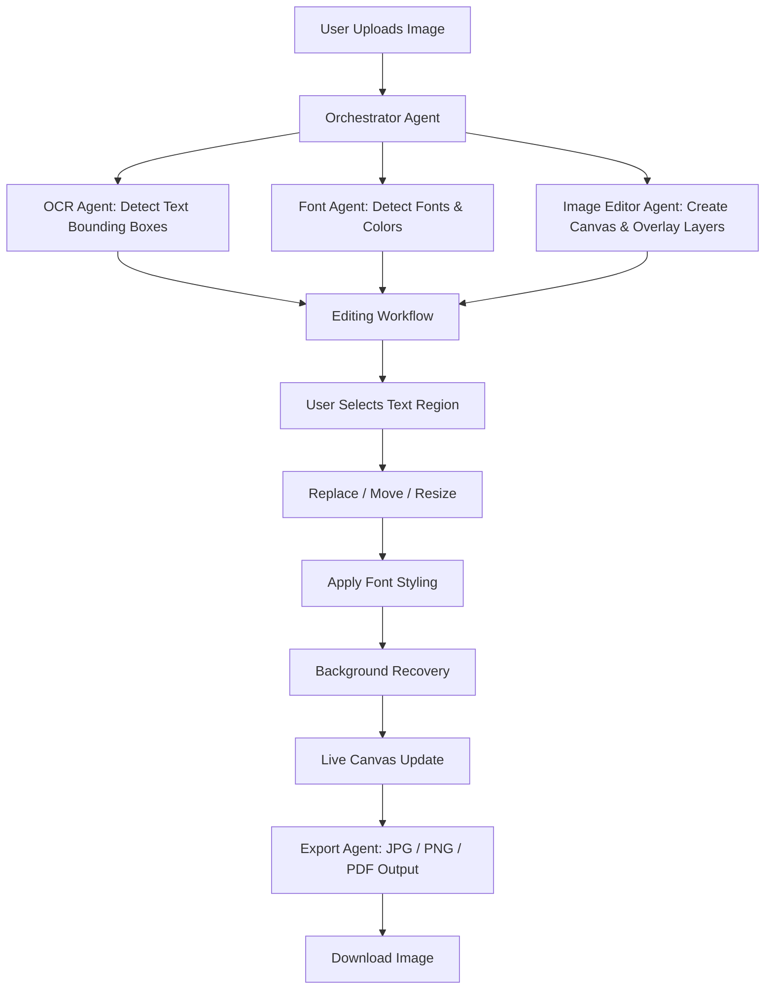
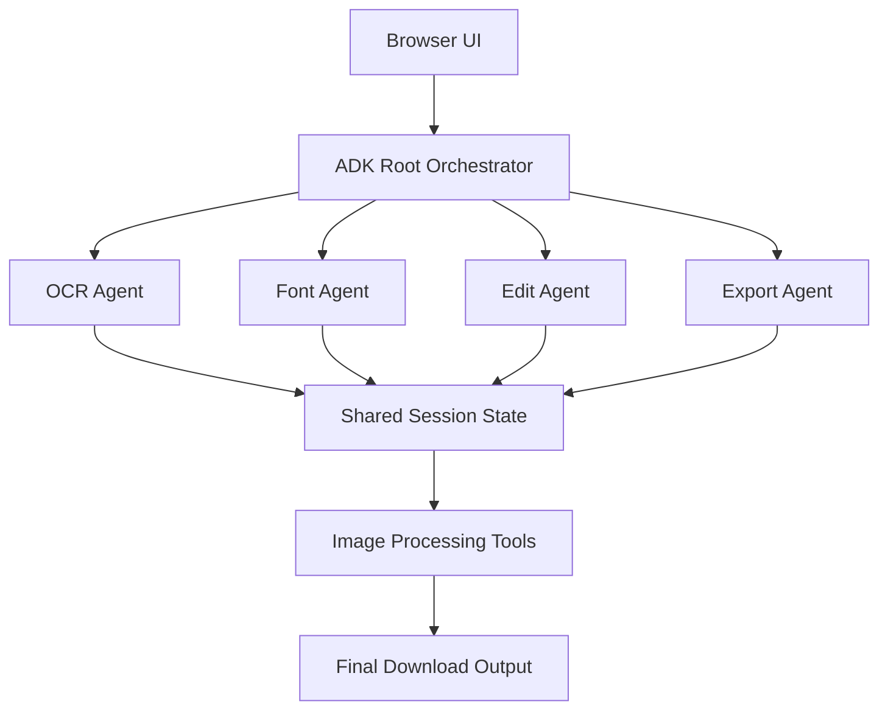

# PhoText-style-image-text-editor

Photext AI Agent is an intelligent system that orchestrates multiple AI agents to perform advanced image processing, text detection, font analysis, and intelligent image editing tasks. The frontend integrates with a set of backend agents that handle localized OCR, semantic background recovery, and seamless text re-rendering.

## Architecture Interaction Graph

```mermaid
flowchart TD
    UI[User Input] --> OA[Orchestrator Agent]
    OA --> OCR[OCR Agent]
    OA --> FA[Font Agent]
    OA --> IA[Image Agent]
    OCR & FA & IA --> EA[Editing Agent]
    EA --> EX[Export Agent]
    EX --> FO[Final Output]
```



## Core Agent Workflow



## Getting Started

Follow these step-by-step instructions to install and run the application on your local machine.

### Prerequisites
- Python 3.8+ installed on your system.
- Git (optional, for cloning the repository).

### Installation Process

1. **Clone the repository** (if you haven't already):
   ```bash
   git clone https://github.com/keerthikumar0810/PhoText-style-image-text-editor.git
   cd PhoText-style-image-text-editor
   ```

2. **Navigate to the agent directory** (where the backend code lives):
   ```bash
   cd photext-ai-agent
   ```

3. **Create a virtual environment** (recommended to keep dependencies isolated):
   - **On Windows**:
     ```bash
     python -m venv venv
     venv\Scripts\activate
     ```
   - **On macOS/Linux**:
     ```bash
     python3 -m venv venv
     source venv/bin/activate
     ```

4. **Install the required dependencies**:
   ```bash
   pip install -r requirements.txt
   ```

5. **Set up Environment Variables**:
   - Copy the sample environment file to create your own `.env` file:
     - On Windows: `copy .env.example .env`
     - On macOS/Linux: `cp .env.example .env`
   - Open `.env` in a text editor and add your API keys (e.g., `GEMINI_KEY`). For example:
     ```env
     FLASK_APP=app.py
     FLASK_ENV=development
     SECRET_KEY=your_secret_key_here
     PORT=5000
     DATABASE_URI=sqlite:///app.db
     GEMINI_KEY=your_gemini_api_key
     ```

### Running the Application

1. **Initialize the Database & Start the Server**:
   Ensure your virtual environment is activated, then run the Flask app:
   ```bash
   python app.py
   ```

2. **Access the Web UI**:
   Open your browser and navigate to:
   [http://127.0.0.1:5000](http://127.0.0.1:5000)

## Overall System Architecture


